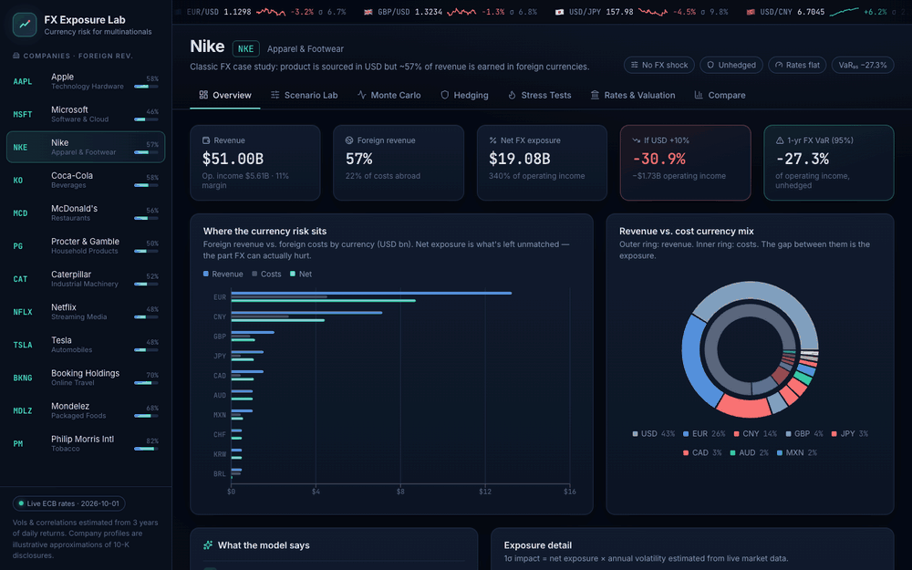

# FX Exposure Lab

**How much would a strong dollar cost Nike? Would hedging help, and how much would it cost?**

FX Exposure Lab is a full-stack analytics app. It models how currency moves, hedging programs and interest-rate shocks flow through a multinational's operating income, EPS and valuation. It uses live ECB exchange rates and a Monte Carlo engine with correlated currencies.

### 🔗 Live demo: **[fx-exposure-lab.onrender.com](https://fx-exposure-lab.onrender.com)**
<sub>Hosted on Render's free tier. The first load after a quiet period can take ~30–50s while the server wakes up.</sub>


[](https://github.com/divyanshatpar05/fx-exposure-lab/actions/workflows/ci.yml)



---

## Features

| Module | What it does |
|---|---|
| **Overview** | Revenue vs. cost currency mix, net exposure per currency, natural-hedge ratio, and a short plain-English summary of the risk. |
| **Scenario Lab** | Sliders for 11 currencies plus presets (USD ±10%, EM crash, euro crisis). Shows an operating-income waterfall bridge and a ±10% sensitivity tornado. |
| **Monte Carlo** | 2k–25k correlated currency paths (Cholesky on a live covariance matrix). Reports the P&L distribution, VaR 95/99, CVaR, tail probabilities, per-currency risk attribution and a correlation heatmap. |
| **Hedging** | Forwards (with real carry from interest-rate differentials) or ATM options per currency, preset programs, and an **efficiency frontier** of tail risk vs. hedge cost. |
| **Stress Tests** | Replays 8 historical episodes against today's exposure: GFC 2008, Taper Tantrum, SNB de-peg, Brexit, 2018 EM selloff, COVID, King Dollar 2022, Dollar Slide 2025. |
| **Rates & Valuation** | Parallel rate shock flowing through floating and maturing debt, EPS and a DCF value bridge, plus a **macro shock surface** heatmap of USD move × rate move. |
| **Compare** | Fragility map and sortable league table across 12 multinationals. |

Hedges, FX shocks and rate shocks are **global state**. Hedges set on one tab apply to the Monte Carlo, stress tests and valuation. Each view is deep-linkable (`/#NKE/montecarlo`).

## Architecture

```
┌──────────────────────────┐        ┌────────────────────────────────────┐
│  React + TypeScript (Vite)│  /api  │  FastAPI                            │
│  Recharts, lucide-react   │ ─────▶ │  engine.py   exposure, hedging, MC, │
│  7 analytic views         │        │              DCF, stress, surface   │
└──────────────────────────┘        │  market.py   live rates → vol/corr  │
                                    └──────────────┬─────────────────────┘
                                                   │ httpx (cached 12h)
                                         Frankfurter API (ECB reference rates)
```

## Methodology

**Convention.** A move *m* is the % change in a foreign currency's value in USD. *m* = −10% means a 10% weaker currency, i.e. a stronger dollar.

**Exposure.** For each currency *c*: revenue *Rᶜ* = revenue × revenue-mix, cost *Cᶜ* = (revenue − EBIT) × cost-mix. Net exposure *Nᶜ = Rᶜ − Cᶜ*. The FX impact on operating income is *ΔEBIT = Σ Nᶜ · mᶜ*.

**Market data.** About 3 years of daily ECB fixings are pulled from the Frankfurter API. Daily log returns are annualised (σ√252), and the correlation matrix is repaired to the nearest positive semi-definite matrix (eigenvalue clipping) before simulation. If the API is unreachable, the app falls back to the disk cache and then to a one-factor "dollar" model.

**Monte Carlo.** *x ~ N(−½σ²T, ΣT)* with Σ = diag(σ)·ρ·diag(σ). Correlated draws come from the Cholesky factor of ΣT, and moves are *m = eˣ − 1*. Risk attribution uses the Euler decomposition *Cov(Nᶜmᶜ, ΔEBIT) / Var(ΔEBIT)*.

**Hedging.**
- *Forward*: P&L = −h·N·m − h·N·(rᶜ − r_USD)·T. Selling a high-yielding currency forward costs carry; selling a low-yielder earns it.
- *ATM option*: payoff = h·|N|·max(−sign(N)·m, 0). Premium ≈ 0.4·σ·√T·h·|N| (Brenner–Subrahmanyam approximation).
- The efficiency frontier sweeps a uniform hedge ratio from 0 to 100% using common random numbers, so the points are directly comparable.

**Rates & valuation.** Interest expense changes by Δr × debt × (floating share + share maturing within 12m). Value comes from a perpetuity-growth DCF, *EV = FCF·(1+g)/(WACC − g)*. FX and interest effects pass through to FCF after tax. Rate moves reach WACC at 50%, because risk premia tend to offset part of a risk-free move. The value bridge breaks the change into FX, interest and discount-rate steps.

**Validation.** The `pytest` suite checks the simulation against closed-form portfolio volatility *√(NᵀΣN)*. It also checks that a 100% forward hedge removes all variance, that options cap the downside at exactly the premium, that forward carry has the right sign, and that bridge components sum to the total.

## Running locally

```bash
# Backend (Python 3.11+)
cd backend
python3 -m venv .venv && source .venv/bin/activate
pip install -r requirements.txt
uvicorn app.main:app --reload --port 8000     # API docs at http://localhost:8000/docs

# Frontend (Node 20+)
cd frontend
npm install
npm run dev                                   # http://localhost:5173 (proxies /api → :8000)
```

Tests: `cd backend && pytest -q`

### Deploy to Render

[](https://render.com/deploy?repo=https://github.com/divyanshatpar05/fx-exposure-lab)

`render.yaml` defines one free Docker web service. Render builds the React app, serves it from FastAPI and redeploys on every push to `main`.

### Single-container deploy

```bash
docker build -t fx-exposure-lab .
docker run -p 8000:8000 fx-exposure-lab       # UI + API on http://localhost:8000
```

FastAPI serves the built frontend when `frontend/dist` exists, so it deploys as one service on Render, Railway or Fly.io.

## API

| Method | Path | Purpose |
|---|---|---|
| GET | `/api/market` | Spot rates, vols, correlations, 1-year history |
| GET | `/api/companies` / `/api/companies/{ticker}` | Profiles, exposure, narrative |
| POST | `/api/analyze` | Scenario impact, tornado, hedge costs, valuation |
| POST | `/api/simulate` | Monte Carlo distribution and risk stats |
| POST | `/api/frontier` | Hedge efficiency frontier |
| POST | `/api/stress` | Historical scenario replay |
| POST | `/api/surface` | FX × rate valuation grid |
| POST | `/api/compare` | Cross-company fragility metrics |

### Re-recording the demo GIF

With both dev servers running: `pip install playwright pillow && python scripts/record_demo.py`. It drives your installed Chrome through a scripted tour and writes `docs/demo.gif` and `docs/screenshot.png`.

## Data disclaimer

The company profiles are **illustrative approximations** of public 10-K geographic disclosures (FY2024–25). Currency splits within regions, cost mixes and debt terms are modeling assumptions. Historical scenario moves are rounded peak-to-trough figures. This is an educational tool, not investment advice.

## Roadmap

- Parse revenue-by-geography automatically from SEC EDGAR XBRL filings
- Fat-tailed (Student-t) and regime-switching return models
- Collars and layered rolling hedge programs
- Upload your own company profile (CSV)
